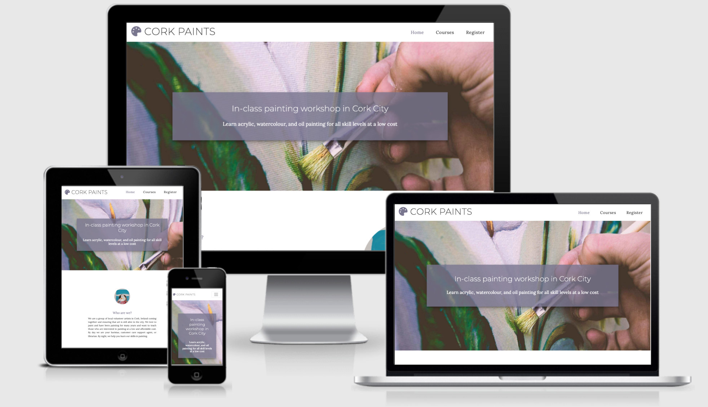
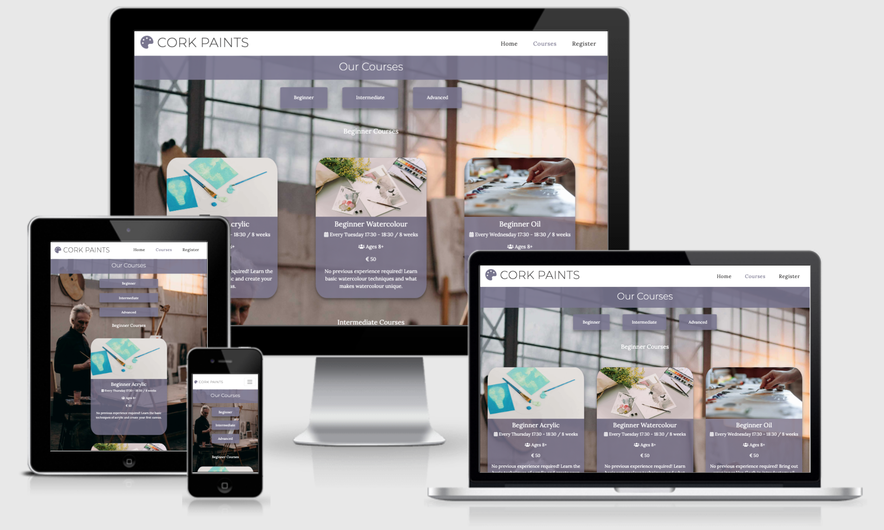

# Cork Paints Website

[View Live Project Here](https://lee-joanne.github.io/cork-paints/)

Cork Paints is a low-cost painting workshop for all different skill levels in Cork City, Ireland. The website is targeted towards people who are interested in painting and looking to attend in-class sessions on evenings or weekends. Cork Paints is useful for anyone who is interested in painting as they accomodate beginniners or expert paints in acrylic, watercolour, or oil for children, teenagers, or adults. 

## User Experience (UX)

* ### User Stories
  - First Time Visitor Goals
    1. As a First Time Visitor. I want to be able to easily understand what Cork Paints has to offer and how they are different from other expensive painting workshops in the city. 
    2. As a First Time Visitor, I can see exactly where Cork Paints is located in the city to know where to travel to for these in-class workshop sessions. 
    3. As a First Time Visitor, I want to read the review section where other customers have tried Cork Paints to be assured this service is reputable, reliable, and sufficient.
 
  - Returning Visitor Goals
    1. As a Returning Visitor, I want to read what different courses Cork Paints has to offer, including the prices, age range, dates, and skill level.
    2. As a Returning Visitor, I want to know the operating hours of Cork Paints and how I can get in touch with any query I may have. 
    3. As a Returning Visitor, I know exactly how to register for my next course as the registration page is very comprehensive and easy to use, thanks to the two dropdown menus to select my course and skill level. 

  - Frequent User Goals
    1. As a Frequent User, I want to be able to find and check out their social media links to be updated with any new events or updates. 
    2. As a Frequent User, I want to see other courses I can try out that is either a skill level higher than the one I have tried previously or to try out a new type of course. I can easily jump to which skill level I want to see by clicking on the links at the top on my mobile device so I can save time scrolling. 

* ### Design
  - Colour Scheme
    - The main colours I have selected for this website are purple (#78748F), white (#fff), and dark grey/black (#232222). For white text with the purple background, I have added 0.8 opacity to make the solid colour less harsh but also to increase readability for the user. These colours work beautifully together and white fonts are used on top of purple backgrounds and black font is used on top of white backgrounds. 
  - Typography
    - The main fonts used are Montserrat and Lora, with Sans Serif used as the fallback font. Montseratt is a sans-serif typeface used for headings throughout the website for high readability when the user is browsing the page. The eyecatching nature of the font is perfect for high level headings because the font is very eyecatching so the users will know exactly what each heading represents. Lora is a gorgeous serif font used for paragraphs and lower level headings. Lora is chosen for it's attractive typography to explain the main details of the website. 
  - Imagery
    - The hero image contains a gorgeous photo of a hand painting on a canvas, with colours that highly suit the colour scheme of the website. The image contains a keyframe to zoom in to catch the user's attention. The images chosen are selected to be minimalistic and artistic which suit the painting theme of Cork Paints.

* ### Wireframes
  - Wireframes have been created using the program Sketch.

    - Desktop Wireframe - [View](assets/wireframes/Desktop.png) 

    - Mobile Wireframe - [View](assets/wireframes/Mobile.png)

    - Tablet Wireframe - [View](assets/wireframes/Tablet.png) 

## Features

* ### Existing Features

