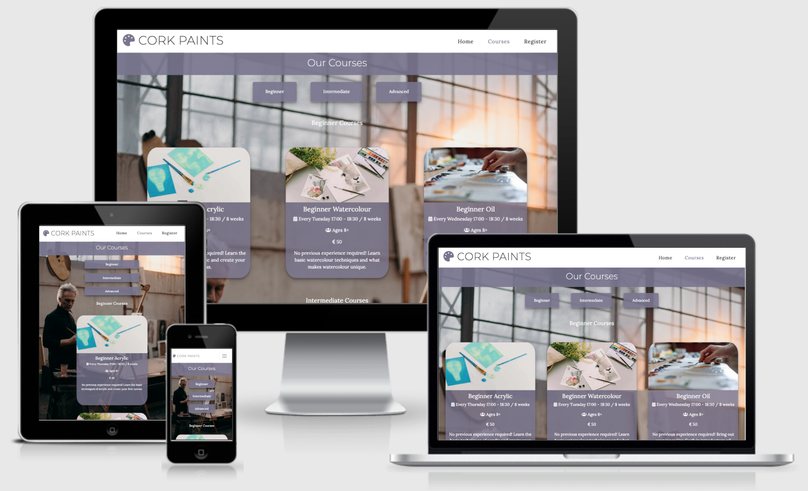
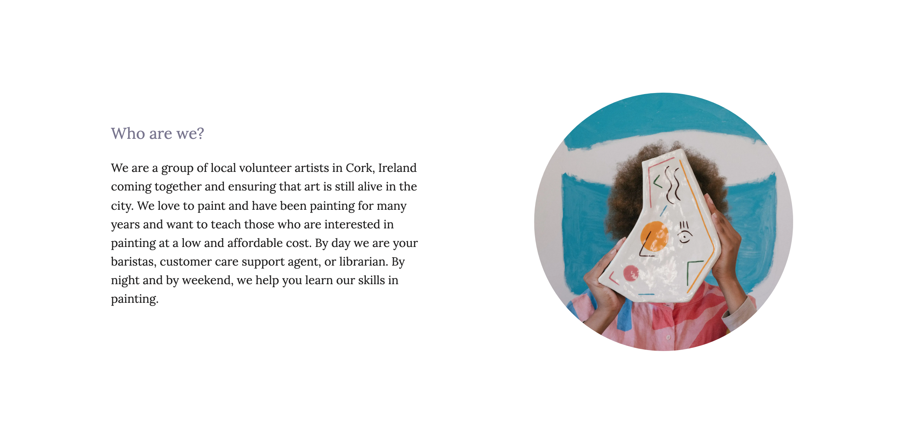

# Cork Paints Website

[View Live Project Here](https://lee-joanne.github.io/cork-paints/)

Cork Paints is a low-cost painting workshop for all different skill levels in Cork City, Ireland. The website is targeted towards people who are interested in learning how to paint and looking to attend in-class sessions on evenings or weekends. Cork Paints is useful for anyone who is interested in painting as they accomodate beginniners or expert paints in acrylic, watercolour, or oil for children, teenagers, or adults. 

## User Experience (UX)

* ### User Stories
  - First Time Visitor Goals

    1. As a First Time Visitor. I want to be able to easily understand what Cork Paints has to offer and how they are different from other expensive painting workshops in the city. 

    2. As a First Time Visitor, I can see exactly where Cork Paints is located in the city to know where to travel to for these in-class workshop sessions. 

    3. As a First Time Visitor, I want to read the review section where other learners have tried Cork Paints to be assured this service is reputable, reliable, and sufficient.
 
  - Returning Visitor Goals

    1. As a Returning Visitor, I want to read what different courses Cork Paints has to offer, including the prices, age range, dates, and skill level.

    2. As a Returning Visitor, I want to know the operating hours of Cork Paints and how I can get in touch with any query I may have. 

    3. As a Returning Visitor, I know exactly how to register for my next course as the registration page is very comprehensive and easy to use, thanks to the two dropdown menus to select my course and skill level. 

  - Frequent User Goals

    1. As a Frequent User, I want to be able to find and check out their social media links to be updated with any new events or updates. 

    2. As a Frequent User, I want to see other courses I can try out that is either a skill level higher than the one I have tried previously or to try out a new type of course. I can easily jump to which skill level I want to see by clicking on the links at the top on my mobile device so I can save time scrolling. 

* ### Design
  - Colour Scheme

    1. Purple (#78748F)
    2. White (#fff)
    3. Black (#232222)

    - The main colours I have selected for this website are purple (#78748F), white (#fff), and black (#232222). For white text with the purple background, I have added 0.8 opacity to make the solid colour less harsh but also to increase readability for the user. These colours work beautifully together and white fonts are used on top of purple backgrounds and black font is used on top of white backgrounds. 

  - Typography

    1. Montserrat
    2. Lora
    3. Sans Serif (fallback)

    - The main fonts used are Montserrat and Lora, with Sans Serif used as the fallback font. Montseratt is a sans-serif typeface used for headings throughout the website for high readability when the user is browsing the page. The eyecatching nature of the font is perfect for high level headings because the font is very eyecatching so the users will know exactly what each heading represents. Lora is a gorgeous serif font used for paragraphs and lower level headings. Lora is chosen for it's attractive typography to explain the main details of the website. 

  - Imagery

    - The hero image contains a gorgeous photo of a hand painting on a canvas, with colours that highly suit the colour scheme of the website. The image contains a keyframe to zoom in to catch the user's attention. The images chosen are selected to be minimalistic and artistic which suit the painting theme of Cork Paints.

* ### Wireframes
  - Wireframes have been created using the program Sketch.

    - Desktop Wireframe - [View](assets/documentation/wireframes/desktop-wireframe.png) 

    - Mobile Wireframe - [View](assets/documentation/wireframes/mobile-wireframe.png)

    - Tablet Wireframe - [View](assets/documentation/wireframes/tablet-wireframe.png) 

## Features

* ### Existing Features

  - Navigation Bar
    - Featured on all three pages, the full navigation bar which is viewed on desktop and large devices shows the logo on the left hand side with an icon from Font Awesome which matches the colour scheme. On the right hand side, 'Home', 'Courses', and 'Register' are added to allow the user to easily direct themselves around the website. The links are consistent in text and size to allow for easy navigation.

    - The page that is currently active is coloured purple (#78748F) for the user to understand which page they are on. When the user hovers over the links, the links change to purple (#78748F) to help the user confirm which link they are about to click.

    - When the device screens go smaller (tablet and mobile sizes), the navigation bar will turn into a hamburger icon. The hamburger icon is perfect for more breathing space between the navigation bar and logo for the users to redirect themselves to a different page. The hamburger icon is great for intuitive navigation as users will easily recognize the hamburger icon's purpose. 

    
    
    

  - Landing Page

    - The landing page contains a large photograph of a painting on a canvas which matches the purple (#78748F) colour scheme and centered text in the middle. The large heading text has white font and has a purple background for contrast. The landing page explains what Cork Paints is, where they are, and what they offer in very brief statements. 

    - The hero image contains an eyecatching animation of zooming up to grab the user's attention.

    

  - About Section

    - The about section contains a paragraph of text and a circular image. The h3 heading is in purple (#78748F) to match the colour scheme of the website and the text is in black to contrast the white background. The text explains who Cork Paints is to allow the users to understand who is behind Cork Paints. This allows the users to feel more connected to the people behind Cork Paints by humanizing the website. 

    - The circular image contains a woman's face behind a painted piece of glass to represent the volunteers of Cork Paints to enhance the aesthetics of this section.

    

  - Testimonial Section

    - The testimonial section contains testimonials and reviews from other learners who have attended Cork Paints. This section contains a large image of a painting as the background image. White text is displayed over purple (#78748F) cards for high readability. There are three cards for the section to be split into thirds to enhance the appeal of the section. 

    - The testimonial section is crucial to give the users the confidence and reassurance that Cork Paints is a reputable website and service. 

    

  - Location Section 

    - The location section contains a card highlighting Cork Paints' hours of operation, address, and telephone number for users to be informed of the hours, location, and how to get in touch. Icons are included in this section for visuals on what each part represents. 

    - An iFrame is included in this section for the user to know exactly where Cork Paints is located. The iFrame is from Google Maps so therefore the user is able to zoom in and out of maps and even look up the directions from their location. 

    

  - Footer 

    - The footer contains links to the social media pages of Cork Paints, including Facebook, Twitter, and Instagram. These links will open in a separate tab so the users will not be directed away from the website entirely. The icons are large to be highly accessible to the user.

    - When hovered, the links will become purple (#78748F) to help the user confirm which link they are about to click.

    - The footer is essential to provide more ways for the user to stay connected with Cork Paints. 

    

  - Courses 

    - 

